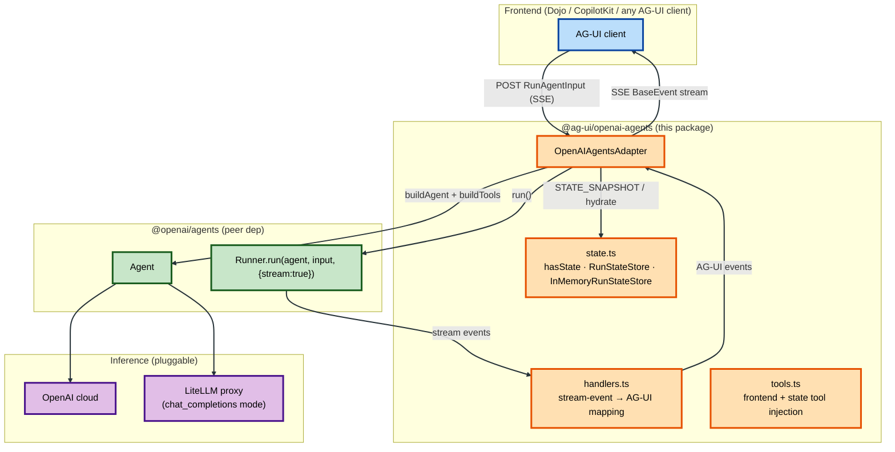
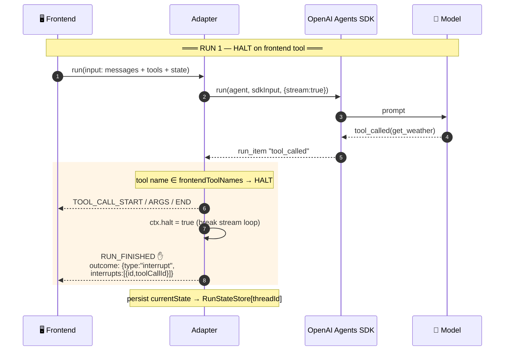
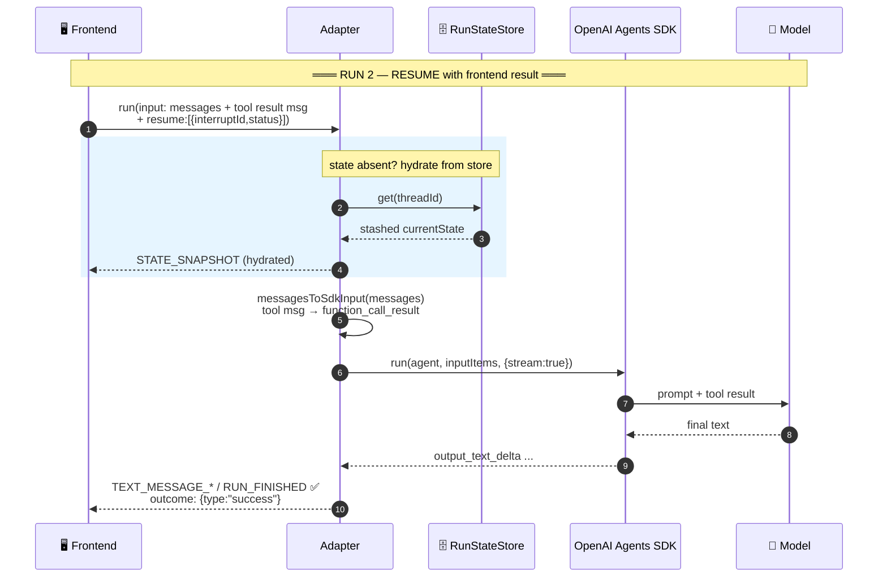
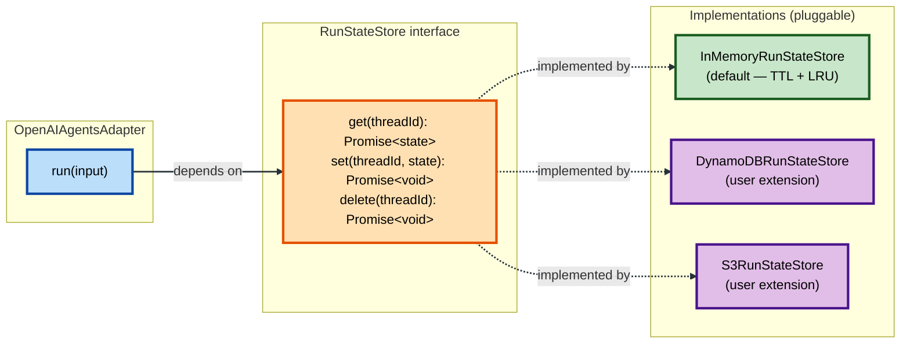

# @ag-ui/openai-agents

Implementation of the [AG-UI protocol](https://docs.ag-ui.com/) for the [OpenAI Agents JS SDK](https://openai.github.io/openai-agents-js/) (TypeScript).

The adapter manages the SDK run lifecycle internally — you call `adapter.run(input)` and subscribe to the resulting AG-UI event stream. It speaks AG-UI to the frontend and the OpenAI Agents JS SDK to the model, with first-class support for OpenAI-compatible endpoints like **LiteLLM**.

## Installation

```bash
npm install @ag-ui/openai-agents @openai/agents zod
```

`@ag-ui/client` and `@ag-ui/core` are required peers (provided by the AG-UI SDK). `openai` is an optional peer, needed only when you point the adapter at a custom `baseURL` (e.g. a LiteLLM proxy).

## Quick start

```typescript
import { OpenAIAgentsAdapter } from "@ag-ui/openai-agents";

const adapter = new OpenAIAgentsAdapter({
  model: "gpt-4o",
  instructions: "You are a helpful assistant.",
  // Point at a LiteLLM-compatible proxy:
  baseURL: process.env.OPENAI_BASE_URL,
  apiKey: process.env.OPENAI_API_KEY,
});

const events$ = adapter.run(input); // input: RunAgentInput
events$.subscribe({
  next: (event) => sendEvent(event), // AG-UI BaseEvent
  complete: () => res.end(),
});
```

## Configuration

`OpenAIAgentsAdapterConfig` (extends `AgentConfig`):

| Option | Description | Default |
|---|---|---|
| `model` | Model name. Falls back to `OPENAI_MODEL` env, then `gpt-5`. | `gpt-5` |
| `apiKey` | OpenAI API key. Falls back to `OPENAI_API_KEY` env. | env |
| `baseURL` | OpenAI-compatible endpoint (e.g. a LiteLLM proxy). When set, the adapter uses **Chat Completions mode** and disables tracing (most proxies don't support the Responses API). Cannot combine with `openAIClient`. | `OPENAI_BASE_URL` env |
| `openAIClient` | A preconfigured `OpenAI` client. Cannot combine with `apiKey`/`baseURL`. | — |
| `instructions` | System prompt / instructions for the agent. | `"You are a helpful assistant."` |
| `tools` | SDK-native **backend** tools (built with `@openai/agents`'s `tool()`) that execute server-side. Distinct from AG-UI frontend tools (see [Tools](#tools)). | `[]` |
| `agentId` | Agent name/id. | `"ag-ui-openai-agent"` |
| `runStateStore` | Custom pause/resume persistence for shared state (see [RunState store](#runstate-store-pluggable-persistence)). Default: in-memory. | in-memory |
| `maxStates` / `stateTtlMs` | Tune the default in-memory store (max entries / idle TTL). | `1000` / `30 min` |

## Architecture

The adapter is a pure protocol translator between AG-UI and the OpenAI Agents JS SDK. It owns no model state of its own; resume is reconstructive (the frontend resends message history, and tool results become `function_call_result` input items).



**Color key:** 🟦 frontend · 🟧 this package · 🟩 OpenAI Agents SDK · 🟪 inference (OpenAI cloud or LiteLLM).

### Design

- **Event-driven, observable** — `run()` returns an RxJS `Observable<BaseEvent>`. All SDK stream events (`RunStreamEvent`) are translated by pure, side-effect-free handlers in `handlers.ts`, making the mapping trivially unit-testable without the SDK runtime.
- **Transport-agnostic** — the adapter emits AG-UI events; the server (see [examples](#examples)) encodes them as SSE, WebSocket, etc. via `@ag-ui/encoder`.
- **LiteLLM-first** — when `baseURL` is set, the adapter wires an OpenAI-compatible client, switches the SDK to `chat_completions` mode (most proxies don't support the Responses API), and disables tracing.
- **Reconstructive resume** — pause/resume does not depend on the SDK's `RunState` serialization (Responses-API-only / couples to SDK internals). The frontend resends the conversation, and `messagesToSdkInput` turns `tool`-role result messages into `function_call_result` items, so the run continues. This works against any backend, including LiteLLM.

## Tools

There are two kinds of tools, and the adapter treats them differently:

### Frontend tools (AG-UI tools)

Provided per-run via `RunAgentInput.tools` by the client. The model calls them, the adapter **halts** the run (emits `TOOL_CALL_*` + a `RUN_FINISHED` interrupt outcome), and the **frontend** executes them, resuming in the next run with the result. See [Human-in-the-loop](#human-in-the-loop-halt--resume).

### Backend tools (SDK-native)

Defined with `@openai/agents`'s `tool()` and passed via `config.tools`. They execute **server-side**; the adapter streams the `TOOL_CALL_*` + `TOOL_CALL_RESULT` lifecycle so the frontend can render them. See the [backend tool rendering example](examples/backend_tool_rendering.ts).

### State tool (`ag_ui_update_state`)

When a run carries shared `state`, the adapter auto-injects an `ag_ui_update_state` function tool. The model calls it with the complete updated state; the adapter **intercepts** that call (it is never surfaced as a frontend tool call) and emits a `STATE_SNAPSHOT`. State semantics are **replace** — the model passes the complete state object in the `state` field (not a patch).

## Human-in-the-loop (halt + resume)

AG-UI frontend tools are executed by the frontend, not the SDK. When the model calls one, the run halts so a human can act:



The frontend then executes the tool and starts a new run, sending the result back as a `tool`-role message. The adapter converts it to a `function_call_result` input item and the model continues:



## RunState store (pluggable persistence)

Across a HITL pause the frontend may not resend `input.state`. The adapter stashes the last-known shared `currentState` per `threadId` behind a `RunStateStore` **interface**, so you can persist paused-run state durably — e.g. to DynamoDB, S3, or Redis — by implementing three async methods:

```typescript
import type { RunStateStore, InMemoryRunStateStore } from "@ag-ui/openai-agents";

// Implement the interface over your backend:
class DynamoRunStateStore implements RunStateStore {
  async get(threadId: string) { /* load from DDB */ }
  async set(threadId: string, state: unknown) { /* write to DDB */ }
  async delete(threadId: string) { /* delete from DDB */ }
}

const adapter = new OpenAIAgentsAdapter({
  model: "gpt-4o",
  runStateStore: new DynamoRunStateStore(),
});
```

The adapter depends only on the interface; the default `InMemoryRunStateStore` (TTL + LRU) is used when none is provided.



**Color key:** 🟦 adapter · 🟧 interface (the seam) · 🟩 default impl · 🟪 user extensions.

## Examples

The package ships 5 example agents in [`examples/`](examples/), served by [`examples/server.ts`](examples/server.ts):

| Route | File | Features |
|---|---|---|
| `/agentic_chat` | [agentic_chat.ts](examples/agentic_chat.ts) | Basic streaming chat |
| `/backend_tool_rendering` | [backend_tool_rendering.ts](examples/backend_tool_rendering.ts) | Server-side SDK `tool()` + `TOOL_CALL_RESULT` rendering |
| `/shared_state` | [shared_state.ts](examples/shared_state.ts) | Bidirectional state sync via `ag_ui_update_state` (replace) |
| `/human_in_the_loop` | [human_in_the_loop.ts](examples/human_in_the_loop.ts) | Frontend tool halt → interrupt → resume |
| `/tool_based_generative_ui` | [tool_based_generative_ui.ts](examples/tool_based_generative_ui.ts) | Frontend tool renders a UI component |

## Demo: run it end-to-end via a UI

The easiest E2E demo uses the **AG-UI Dojo** — a Next.js demo viewer (`apps/dojo`) that provides a chat UI, shared-state panel, and human-in-the-loop controls out of the box.

### Option A — against a LiteLLM proxy (recommended for the GoDaddy AI platform)

1. **Start the example server** (port `8030`):

   ```bash
   cd integrations/openai-agents/typescript
   pnpm install
   OPENAI_API_KEY=<litellm-key> \
   OPENAI_BASE_URL=https://litellm.example.com/v1 \
   OPENAI_MODEL=openai/gpt-4o \
     pnpm dev:examples
   ```

   You should see:
   ```
   OpenAI Agents JS (TypeScript) server running on http://localhost:8030
     → inference endpoint: https://litellm.example.com/v1
     POST http://localhost:8030/agentic_chat
     ...
   ```

2. **Wire it into the Dojo.** The Dojo discovers agents via `HttpAgent` + an env var. Add the integration to `apps/dojo/src/agents.ts`:

   ```typescript
   // alongside the other integrations
   "openai-agents-typescript": async () =>
     mapAgents(
       (path) =>
         new HttpAgent({
           url: `${envVars.openaiAgentsTypescriptUrl}/${path}`,
         }),
       {
         agentic_chat: "agentic_chat",
         backend_tool_rendering: "backend_tool_rendering",
         shared_state: "shared_state",
         human_in_the_loop: "human_in_the_loop",
         tool_based_generative_ui: "tool_based_generative_ui",
       },
     ),
   ```

   Add the env var to `apps/dojo/src/env.ts`:

   ```typescript
   openaiAgentsTypescriptUrl:
     process.env.OPENAI_AGENTS_TYPESCRIPT_URL || "http://localhost:8030",
   ```

   And register a menu entry in `apps/dojo/src/menu.ts` (mirror the `claude-agent-sdk-typescript` entry with `id: "openai-agents-typescript"`).

3. **Start the Dojo** (port `3000`):

   ```bash
   cd apps/dojo
   pnpm install
   pnpm dev
   ```

4. Visit **http://localhost:3000**, select **"OpenAI Agents JS (TypeScript)"**, and try the agents. For `human_in_the_loop`, ask it to plan a task — the run halts on `generate_task_steps`, you select steps in the UI, and the conversation resumes.

> Only the example server is part of this package. The Dojo edits above are in the `apps/dojo` app and are a convenience for demoing with a ready-made UI; they're a separate change you apply locally.

### Option B — against the OpenAI cloud

Same as Option A, but omit `OPENAI_BASE_URL`/`OPENAI_MODEL`:

```bash
OPENAI_API_KEY=sk-xxx pnpm dev:examples
```

### Option C — no UI, just curl (smoke test)

```bash
# start the server (Option A or B), then:
curl -N -X POST http://localhost:8030/agentic_chat \
  -H "Content-Type: application/json" \
  -H "Accept: text/event-stream" \
  -d '{
    "threadId":"t1","runId":"r1","messages":[{"id":"m1","role":"user","content":"Say hi"}],
    "tools":[],"context":[],"state":{},"forwardedProps":{}
  }'
```

You'll see AG-UI SSE events: `RUN_STARTED`, `TEXT_MESSAGE_*`, `MESSAGES_SNAPSHOT`, `RUN_FINISHED`.

## Live integration test

The unit test suite mocks `@openai/agents` and needs no key. A live test against a real endpoint is gated behind `OPENAI_API_KEY` and is skipped when the variable is absent. To run it, **export `OPENAI_API_KEY` in your shell first** (point `OPENAI_BASE_URL` at a LiteLLM proxy for the GoDaddy AI platform path).

```bash
OPENAI_API_KEY=<key> OPENAI_BASE_URL=<litellm-url> pnpm test
```

## Development

```bash
pnpm install
pnpm build        # tsup build (CJS + ESM + dts)
pnpm test         # vitest
pnpm typecheck    # tsc --noEmit
pnpm dev:examples # tsx --watch examples/server.ts
```

## Links

- [OpenAI Agents JS SDK](https://openai.github.io/openai-agents-js/)
- [AG-UI Documentation](https://docs.ag-ui.com/)
- [AG-UI State Management](https://docs.ag-ui.com/concepts/state)
- [AG-UI Dojo (demo viewer)](https://github.com/ag-ui-protocol/ag-ui/tree/main/apps/dojo)
